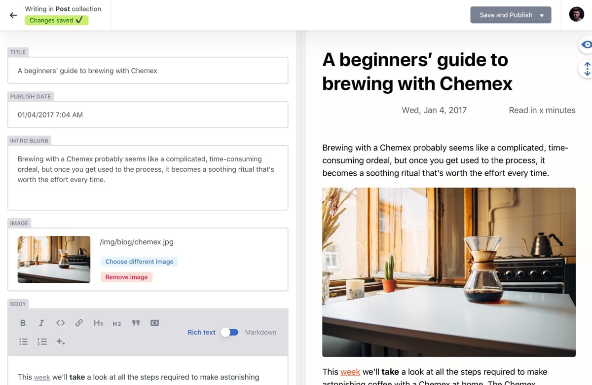

This is the very first blog post on my blog. I think it is symbolic to write about the blog itself. More precisely, about its *tech stack*.

I wanted to create for myself very fast blog with little-to-no JavaScript, only static HTML and little CSS. Because it's static, it doesn't need any fancy servers and so it can be hosted for free on [Netlify](https://www.netlify.com/) or [GitHub pages](https://pages.github.com/) (and probably others). Because it doesn't have any fancy JavaScript, it is fast on any device and for all visitors regardless of their Internet connection speed.

## Hosting

For hosting I chose Netlify as I have had some experience with it already. If you don't know, Netlify/GitHub pages are great options to host any website for free (you only pay for second-level domain name if you need it). Source code of the blog is hosted on [my GitHub](https://github.com/jjonescz/blog) (this one is public but it can be private for free as well if you don't feel like sharing source code of your website).

## Static site generator

With the described setup, you can simply start writing your blog in pure HTML with some CSS styles to give it nice looks, but there is simpler way. You can write your content in Markdown (or rich-text editor as I describe [below](#bonus-headless-cms)) and have it converted to HTML/CSS site (SEO included) at build time. This conversion happens automatically in Netlify whenever you push to `master` branch of your GitHub repository. Netlify provides enough [build minutes for free](https://www.netlify.com/pricing/) to rebuild your blog as often as you manage to write content.

There are many [static site generators](https://jamstack.org/generators/) that convert content written in some simple format (usually Markdown) to static HTML website (or sometimes JavaScript single-page app). I chose [Hugo](https://gohugo.io/) which provides lots of functionality out of the box and its builds are blazingly fast.

Note that in Hugo, you simply create posts as separate Markdown pages. Each page can have some properties (e.g., title, date of publication, authors, cover image, etc.) in so-called [front matter](https://gohugo.io/content-management/front-matter/) which is nothing more than YAML/TOML config file embedded at the beginning of Markdown file.

## Theme

Static site generator of course needs to put your raw content into some nicely-looking webpage. Hugo has many [themes](https://themes.gohugo.io/), most of them are tailored for blogs (as is Hugo itself and probably most of the other static site generators, as well). However, I have also created photo gallery in Hugo (portfolio of artist/photographer, actually)&mdash;I will write about it soon.

For my blog, I use the beautiful [PaperMod](https://github.com/adityatelange/hugo-PaperMod/) theme which exactly fits my needs, because it is

* simple and fast (consists of just HTML + small CSS, has no unnecessary JavaScript, fonts, icons that would load for every visitor of my blog),
* SEO optimized (e.g., generates [structured data](https://developers.google.com/search/docs/guides/intro-structured-data)),
* with light and dark mode (some developers love it, some hate it, but everyone should have a choice).

## Getting started

To create a blog similar to mine, you can either fork [my repository](https://github.com/jjonescz/blog), or follow these steps:

1. [Install Hugo](https://gohugo.io/getting-started/installing).

2. Create new Hugo site (see [Hugo Quick Start guide](https://gohugo.io/getting-started/quick-start/)):

   ```shell
   hugo new site blog
   ```

3. Add the site to Git (`cd blog`, `git init`, ...).

4. Add PaperMod theme (see [PaperMod Installation guide](https://adityatelange.github.io/hugo-PaperMod/posts/papermod/papermod-installation/)):

   ```shell
   git submodule add https://github.com/adityatelange/hugo-PaperMod.git themes/hugo-PaperMod
   ```

5. Configure your Hugo website and PaperMod theme&mdash;add [config.yml](https://adityatelange.github.io/hugo-PaperMod/posts/papermod/papermod-installation/#sample-configyml) file. You can start with something like [this](https://github.com/jjonescz/blog/blob/96b4ea6e03bb2509e577af82defd888354da4e38/config.yml):

   ```yml
   baseURL: "https://janjones.me/"
   title: "Jan Jones"
   theme: "hugo-PaperMod"
   ```

6. Run local development server:

   ```shell
   hugo server -D
   ```

7. Now you can see your website at <http://localhost:1313>.

8. Configure Netlify deployment. Netlify looks for [`netlify.toml` file](https://docs.netlify.com/configure-builds/file-based-configuration/) in root of your repository. This is a good starting point for Hugo:

   ```toml
   [build]
     publish = "public"
     command = "hugo --gc --minify"

   [build.environment]
     HUGO_VERSION = "0.79.0"
     HUGO_ENV = "production"
     HUGO_ENABLEGITINFO = "true"

   [context.deploy-preview]
     command = "hugo --gc --minify --buildFuture -b $DEPLOY_PRIME_URL"

   [context.branch-deploy]
     command = "hugo --gc --minify -b $DEPLOY_PRIME_URL"
   ```

   I have also included [these lines](https://github.com/jjonescz/blog/blob/026088ac7a51ec6c24f3c77115f6fc96393f16ec/netlify.toml#L16-L19) to ensure RSS feed file has proper `Content-Type`:

   ```toml
   [[headers]]
     for = "index.xml"
     [headers.values]
       Content-Type = "application/rss+xml"
   ```

   And [these](https://github.com/jjonescz/blog/blob/026088ac7a51ec6c24f3c77115f6fc96393f16ec/netlify.toml#L21-L25) to redirect from third-level Netlify domain to my own second-level domain:

   ```toml
   [[redirects]]
     from = "https://janjones.netlify.app/*"
     to = "https://janjones.me/:splat"
     status = 301
     force = true
   ```

9. By default you get random third-level domain from Netlify (e.g., `something-random.netlify.app`) where your app is available as soon as you push it to `master` and it gets built on Netlify (which is usually very fast with Hugo). You can change it to something more appropriate in your site's settings, although it will still contain `netlify.app` suffix (so you get something like `my-cool-blog.netlify.app`). However, you can also buy your own second-level domain (e.g., `my-cool-blog.com`). I recommend doing that directly through Netlify, it is the easiest way and you also get free SSL certificate (for HTTPS) immediately setup. Go to [your Netlify account](https://app.netlify.com/), select your site, click on “Domain settings” > “Add custom domain” and Netlify will guide you through the purchase (or transferring existing domain).

10. You can add new post using Hugo command:

    ```shell
    hugo new posts/my-first-post/index.md
    ```

    Alternatively, you can create the Markdown file yourself, but don't forget to add [front matter](https://gohugo.io/content-management/front-matter/) with useful properties like title and publication date.

## Customizations

I have already many ideas how to improve the theme to make my blog just *perfect*. I will write more posts about these improvements as I make them; starting now with small changes I already did.

### Disabling Highlight.js

My blog obviously contains code snippets. To be readable they need to be highlighted properly. Hugo supports static [code-highlighting](https://gohugo.io/content-management/syntax-highlighting/#highlighting-in-code-fences) (static means that code fragments are transformed to HTML tags with proper colors at build time). However, PaperMod theme uses [Highlight.js](https://highlightjs.org/) library which does the same thing at runtime in user's browser (it was probably added before Hugo added support for code highlighting and there is already a [PR](https://github.com/adityatelange/hugo-PaperMod/pull/143) to remove it).

Highlight.js is enabled in PaperMod in [`layout/partials/footer.html` file](https://github.com/adityatelange/hugo-PaperMod/blob/b4933eadd65f922cad20e5f9da68ef645564ebfe/layouts/partials/footer.html#L17-L26). To customize templates in Hugo, you can [override these layout files](https://adityatelange.github.io/hugo-PaperMod/posts/papermod/papermod-how-to/#override-theme-template). So, I have created new [`layout/partials/footer.html` file](https://github.com/jjonescz/blog/blob/16a10b59fe8986a5c3d774d621622f5d721f0d18/layouts/partials/footer.html) in my repository with the Highlight.js snippet removed.

(I know this is not ideal because it leads to code duplication and you have to manually update the copied layout file whenever you update the theme and the original file changes to ensure consistency. However, this is the only way I know these things can be done in Hugo unless the theme itself provides configuration variables or more fine-grained template files to customize everything. The very popular Hugo template [wowchemy](https://wowchemy.com/), which I have also used previously, has very worked-out customization but I still had to sometimes copy whole layout files to modify just fraction of them.)

### Footer customization

Next I have added [RSS link](https://github.com/jjonescz/blog/blob/026088ac7a51ec6c24f3c77115f6fc96393f16ec/layouts/partials/footer.html#L8) to footer and replaced "powered by Hugo" text with [link](https://github.com/jjonescz/blog/blob/026088ac7a51ec6c24f3c77115f6fc96393f16ec/layouts/partials/footer.html#L10) to custom [stack page](https://github.com/jjonescz/blog/blob/9277c26785a02be29988a7786e331a10f53fcd18/content/stack.md) where I can provide more details about the software that powers my blog and it doesn't clutter every page.

## Bonus: Headless CMS

Maybe you are creating a blog for someone who doesn't know Markdown or you just want to write your blog posts in web browser without the need to open your Markdown editor and terminal for Git (as I think might be my case sometimes). And you still want to host your blog for free on GitHub+Netlify or similar combo. That is where [headless CMS](https://jamstack.org/headless-cms/) comes to the rescue.

I will describe [Netlify CMS](https://www.netlifycms.org/) (it was a natural choice for me since I host the website on Netlify). It allows you to edit your pages in user-friendly interface with rich text WYSIWYG editor, image selectors, etc.



To install Netlify CMS, you just add `config.yml` and `index.html` files to [`static/admin` folder](https://github.com/jjonescz/blog/tree/026088ac7a51ec6c24f3c77115f6fc96393f16ec/static/admin), enable [Netlify Identity](https://docs.netlify.com/visitor-access/identity/) and are good to go. The whole process is described for example in the [official Netlify docs](https://www.netlifycms.org/docs/hugo/#getting-started-with-netlify-cms).

Netlify CMS is very generic and can work with many static site generators. How the editor emits files that your static site generator understands is controlled by [`config.yml` file](https://www.netlifycms.org/docs/configuration-options/). For very popular themes like [wowchemy](https://wowchemy.com/), there is this configuration [available](https://github.com/wowchemy/wowchemy-hugo-modules/blob/6c434e6de205ab5877dd4879e225e995ca703499/netlify-cms-academic/static/admin/config.yml) with prefilled decent defaults, so you can just start using it. You can use this or some other similar config for most Hugo themes although you might need to slightly modify some properties here and there since every theme might use different ones (although the most important ones like Title and Body are always the same).

I will describe my `config.yml` file for PaperMod theme I created for this blog. It is quite long (because it is repetitive) so I won't include it here, but you can find the [version](https://github.com/jjonescz/blog/blob/026088ac7a51ec6c24f3c77115f6fc96393f16ec/static/admin/config.yml) I will be talking about on my GitHub.

I have [enabled](https://github.com/jjonescz/blog/blob/026088ac7a51ec6c24f3c77115f6fc96393f16ec/static/admin/config.yml#L5) `editorial_workflow` mode which means that whenever I create new blog post, a PR is opened, can be reviewed and "accepted" in separate stages (which can be done through Netlify CMS UI, as well). Only when it is accepted, it gets merged and the blog post is publicly visible. I do this because I like to have my posts reviewed by another person before I publish them and GitHub PR reviews are great for that. This means I don't use standard Hugo's [drafts](https://gohugo.io/getting-started/usage/#draft-future-and-expired-content), but if you don't enable `editorial_workflow` mode, you should definitely [enable drafts](https://github.com/wowchemy/wowchemy-hugo-modules/blob/6c434e6de205ab5877dd4879e225e995ca703499/netlify-cms-academic/static/admin/config.yml#L156-L160), so that you can save your in-progress blog posts into your repository without making them visible to everyone until they are ready.

I have also [disabled](https://github.com/jjonescz/blog/blob/026088ac7a51ec6c24f3c77115f6fc96393f16ec/static/admin/config.yml#L8-L9) instant previews because they don't work very well until custom CSS is provided to Netlify CMS (I plan to do that in the future).

I have made slug (title of the post that is visible in the URL of the page) [customizable](https://github.com/jjonescz/blog/blob/026088ac7a51ec6c24f3c77115f6fc96393f16ec/static/admin/config.yml#L19), but you definitely don't need to do that&mdash;Netlify CMS will automatically convert your titles to URL-safe strings.

And finally, I have [used](https://github.com/jjonescz/blog/blob/026088ac7a51ec6c24f3c77115f6fc96393f16ec/static/admin/config.yml#L17-L18) a [preview feature](https://www.netlifycms.org/docs/beta-features/#folder-collections-media-and-public-folder) of Netlify CMS to ensure images (including cover image of every post) are uploaded alongside the blog post's Markdown instead of global media folder. There is no particular reason to not use the global folder, I just wanted to have posts and their images more self-contained.

## Conclusion

I have shown you how I created my blog (hosted for free on Netlify and GitHub). It consists of simple (yet SEO-friendly) static HTML and CSS files (which is everything a fast blog needs). Once configured, it can be even managed by non-programmer thanks to Netlify CMS.

As I continue adding more functionality to the blog (search, comments, PWA, LaTeX math, etc.), I plan to write more detailed blog posts about each addition.

**UPDATE**: I have added [Cactus.chat](https://cactus.chat/)-based comments recently (see below). I haven't written any post about it yet, but it is very simple to integrate.
